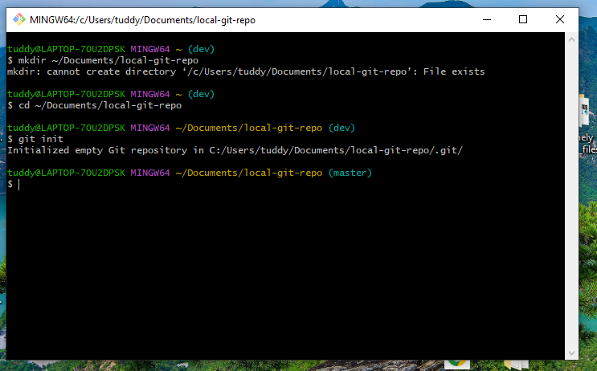
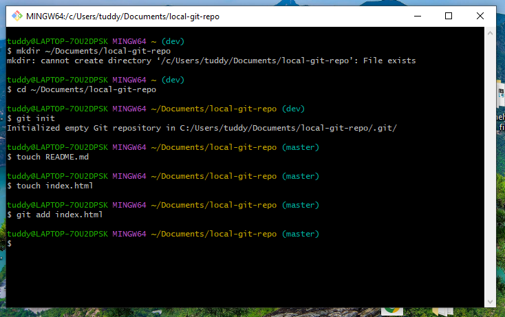
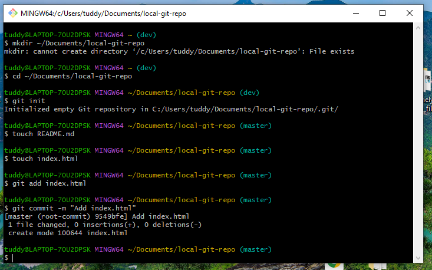
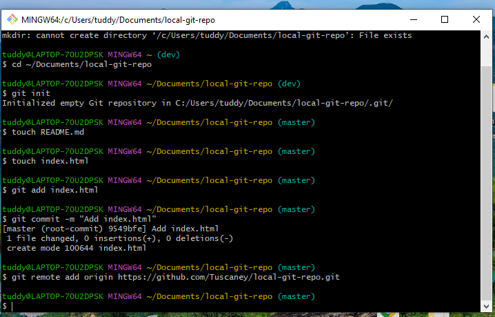
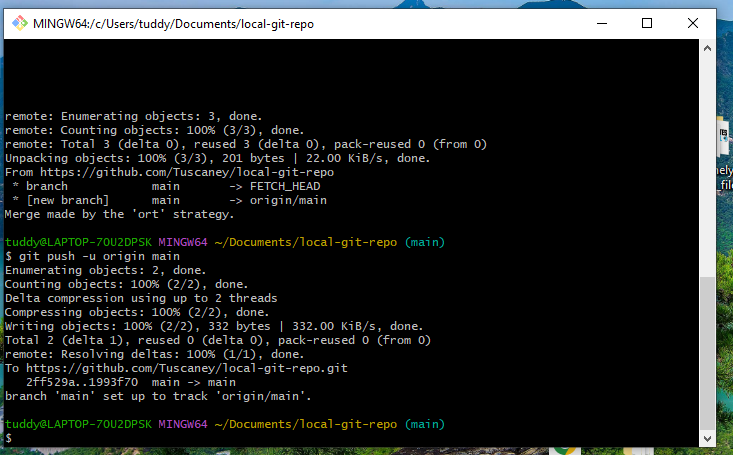
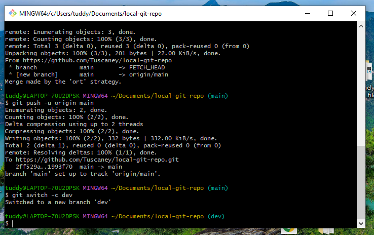
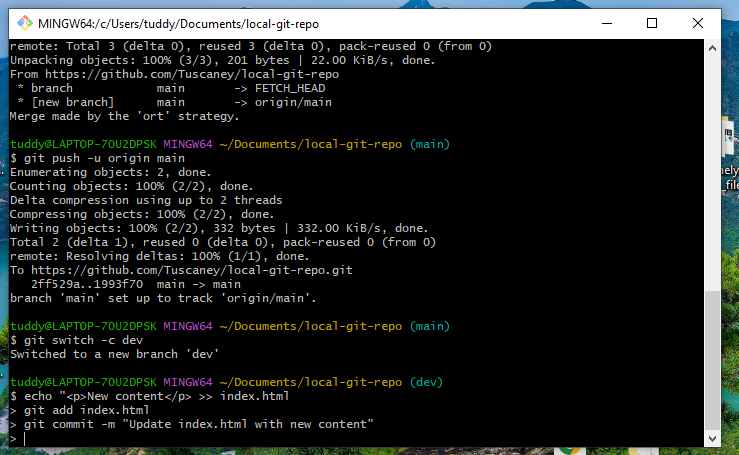
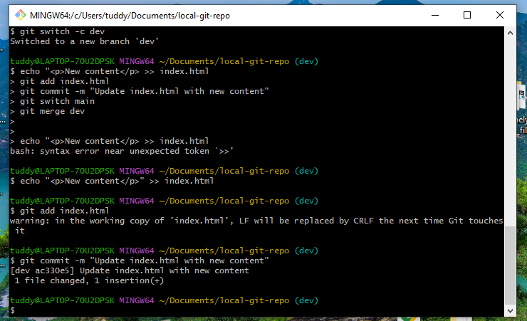
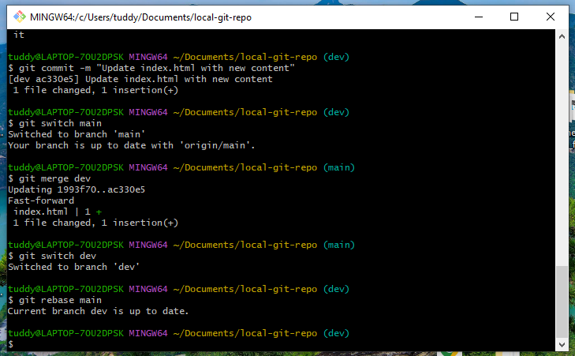

# Local Git Repository Assignment

This project demonstrates working with Git and GitHub, including repository initialization, committing changes, using branches, and understanding merge vs. rebase.

---

## Part 1: Initialize Git Repository

**Command:**
```bash


## Part 2: Adding File and Committing Changes



## Part 3: Connecting to GitHub and Pushing Chnges



## Part 4: Created New Branch



## Part 5: Merge and Rebase



git init 